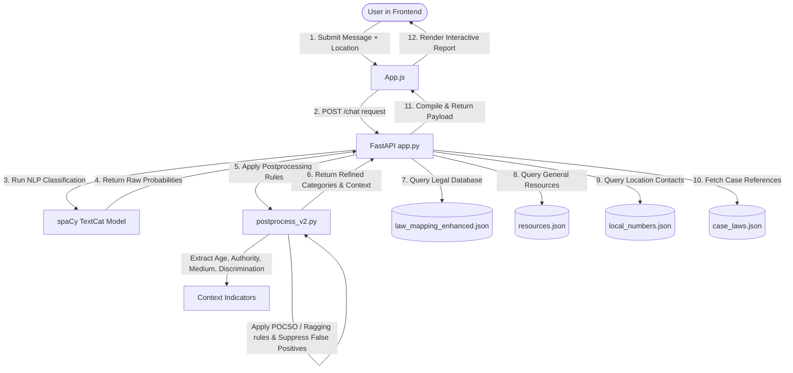

# ⚖️ Judi: Legal Support Chatbot for Students

Judi is a comprehensive, production-ready AI-powered legal support system designed specifically to help students in India identify, understand, and act upon their legal rights when facing crimes, harassment, or administrative violations within educational institutions.

The application combines a modern React user interface, a fast ASGI backend powered by FastAPI, and a custom **Natural Language Processing (NLP)** classification pipeline with a **rule-based postprocessing engine**. When a student describes an incident in plain text, Judi dynamically classifies the infraction, extracts the relevant context, determines governing Indian laws (including Special Acts like POCSO, POSH, and UGC regulations), and suggests actionable filing procedures alongside localized support resources.

---

## 🔄 End-to-End System Workflow

Judi handles user interactions through a multi-stage request-response loop that combines Machine Learning inference with rule-based legal logic and database queries.



### End-to-End Data Processing Stages:

1. **User Interaction & Input Intake**:
   - The user registers or logs in via the React client. The password is encrypted on the backend using `SHA-256` hashing with a secure unique salt.
   - The user selects their local jurisdiction (e.g. `Palakkad Town North`, `Kunnathurmedu`, etc., populated dynamically from the backend's `/locations` endpoint) or keeps the default `National` setting.
   - The user submits their query (e.g. *"I am 16 and my senior touched me inappropriately in the hostel"*).

2. **Backend Routing & Text Analysis**:
   - The client issues a `POST /chat` request containing the `message` string and optional `location`.
   - The FastAPI backend in [app.py](file:///c:/Users/USER/Desktop/internship/legal-support-chatbot/app.py) loads the query and sends it to the custom spaCy NLP model ([models/legal_textcat](file:///c:/Users/USER/Desktop/internship/legal-support-chatbot/models/legal_textcat)) which uses a Convolutional Neural Network (CNN) to predict probability scores across 20 distinct legal violation categories.

3. **Rule-Based Post-processing**:
   - The raw category predictions are passed to [postprocess_v2.py](file:///c:/Users/USER/Desktop/internship/legal-support-chatbot/nlp/postprocess_v2.py) along with the raw text.
   - **Context Extraction**: It runs regular expressions and keyword checks to determine context attributes:
     - **Age Group**: Determines if the user is a `minor` (under 18) or `adult` (e.g. parses *"I am 16"*, *"16 years"* or keywords like *"school"*).
     - **Perpetrator Authority**: Checks if the offender is a `faculty` member, `administration` official, `hostel_warden`, or `senior_student`.
     - **Medium**: Evaluates if the incident is `online` (cyber), `offline` (physical), or `mixed`.
     - **Discrimination Basis**: Triggers if discrimination occurred based on `caste`, `race`, `religion`, or `gender`.
   - **Logical Refinements**:
     - *POCSO Act Auto-Trigger*: If the user is a `minor` and the incident is sexual (`sexual_assault`, `sexual_harassment`, `cyber_sexual_crime`), the system forces the applicable legal framework to **Protection of Children from Sexual Offences (POCSO) Act, 2012** rather than normal adult codes.
     - *Campus/Ragging Boosting*: If the context contains a campus setting or authority figure like a "senior", it boosts the `ragging` or `institutional_misconduct` categories. It also suppresses false-positive sexual crime labels if no sexual keywords are in the query text.
     - *Medium Checks*: Suppresses all cyber categories if no online keywords are present in the text, ensuring offline crimes don't trigger false cyber alerts.
     - *Stalking Validation*: Requires persistence keywords (e.g. *"always"*, *"keeps"*, *"every day"*) to maintain a stalking category unless stalking is explicitly stated.

4. **Resource & Law Assembly**:
   - The backend reads the refined categories list and queries:
     - [law_mapping_enhanced.json](file:///c:/Users/USER/Desktop/internship/legal-support-chatbot/data/law_mapping_enhanced.json): Retrieves matched Indian Penal Code (IPC) sections, Special Acts, and detailed filing procedures.
     - [resources.json](file:///c:/Users/USER/Desktop/internship/legal-support-chatbot/data/resources.json): Fetches emergency helpline numbers, police cells, and free legal aid options.
     - [local_numbers.json](file:///c:/Users/USER/Desktop/internship/legal-support-chatbot/data/local_numbers.json): If a local jurisdiction was provided, regional police station phone numbers, nearby clinics, and specific local legal aid counselors are loaded and appended.
     - [case_laws.json](file:///c:/Users/USER/Desktop/internship/legal-support-chatbot/data/case_laws.json): Adds landmark Supreme Court / High Court case citations for user reference.

5. **Client-Side Rendering**:
   - The client parses the JSON response containing categories, confidence scores, context keys, laws, procedures, warnings, and contacts.
   - The frontend renders an interactive, formatted Markdown report, allowing the user to click **"Show Full Details"** to open a detailed inspection panel with complete sections, filing advice, and helplines.

---

## 📂 Detailed Project File Structure

Below is the directory map of the project, including descriptions of all code files, data assets, and execution scripts:

```
legal-support-chatbot/
│
├── app.py                             # Core FastAPI application hosting REST endpoints, CORS rules, auth, and logic orchestration
├── requirements.txt                   # List of Python dependencies (FastAPI, spaCy, Uvicorn, Pydantic)
├── setup.sh                           # Shell script to install backend requirements and frontend npm packages in one command
├── start.sh                           # Script to manage active ports, boot the FastAPI server and React client in the background
├── TODO.md                            # Outline of implementation goals and location selector additions
├── test.py                            # Simple test script to verify local spaCy model loading and test classification output
├── test_classification.py             # CLI script to test classifier confidence scores and post-processor adjustments
│
├── data/                              # Data store containing JSON catalogs, training CSVs, and user sessions
│   ├── dataset.csv                    # Final augmented text dataset (1500+ items) used to train the spaCy model
│   ├── dataset_new.csv                # Temporary or newly structured dataset for verification
│   ├── dataset_backup.csv             # Backup copy of the seed classification dataset
│   ├── law_mapping_enhanced.json      # Structured list of 50+ Indian legal codes, sections, descriptions, and filing steps
│   ├── resources.json                 # National helplines, police cells, and non-profits grouped by crime categories
│   ├── local_numbers.json             # Location-specific police stations, hospitals, and legal counsel for Palakkad sub-wards
│   ├── case_laws.json                 # Citatons of landmark judicial precedents mapped to categories
│   ├── users.json                     # Local authentication database holding salted, hashed user login credentials
│   └── consultations/                 # Directory holding conversation logs saved as JSON files per-user (e.g. student123.json)
│
├── nlp/                               # Natural Language Processing codebase and training utilities
│   ├── train_classifier.py            # Model training script; loads dataset.csv, configures spaCy blank model, and trains textcat
│   ├── test_classifier.py             # Basic script to run sample strings through the classifier pipeline
│   ├── postprocess.py                 # Legacy/v1 rule-based category adjustment code
│   └── postprocess_v2.py              # Advanced post-processing suite containing Context Extraction and legal override logic
│
├── models/                            # Folder holding final binary weights of the machine learning model
│   └── legal_textcat/                 # Trained spaCy classification model (contains meta.json, vocab, config, and pipeline layers)
│
├── frontend/                          # Client-side React application folder
│   ├── package.json                   # React configurations, scripts (start, build, test), and library dependencies
│   ├── package-lock.json              # Version locked dependency tree for npm
│   ├── public/                        # Static index.html asset folder
│   └── src/                           # Source files for React components and styling
│       ├── App.js                     # Main UI component; handles session storage, location dropdowns, and markdown reports
│       ├── App.css                    # Judi Design System stylesheet supporting Light Mode and Dark Mode styling
│       ├── index.js                   # Main application entry mount point
│       └── index.css                  # Minimal baseline styles
│
├── tests/                             # Specialized testing folders
│   └── test_cyberbullying.py          # Script containing targeted testing scenarios for cyber harassment and bullying
│
└── dataset_augmentation_scripts/      # Python scripts to synthesize and amplify dataset training items (stored in root)
    ├── generate_dataset.py            # Generates the baseline dataset CSV from text templates
    ├── expand_training_data.py        # Expands dataset with active/passive voice, relative/family, and touched variations
    ├── enhance_cyberbullying.py       # Augments cybercrime, cyberbullying, and digital harassment examples
    ├── expand_comprehensive_training.py# Expands general violence, misconduct, and discrimination classes
    ├── add_phrase_variations.py       # Injects minor phrase structures to prevent classification skewing
    └── add_final_examples.py          # Injects targeted examples for remaining model edge cases
```

---

## 🎯 Supported Crime Categories & Frameworks

The model and databases support the following 20 categories:

| Category | Description | Primary Legal Frameworks |
|---|---|---|
| `physical_assault` | Physical fights, beatings, bodily harm | IPC Section 323, 324, 325, 341 |
| `sexual_assault` | Non-consensual sexual touch, rape | IPC Section 375, 376; POCSO Act (Minors) |
| `sexual_harassment` | Sexual remarks, unwanted advances, workplace/hostel abuse | Sexual Harassment of Women Act (POSH), 2013 |
| `ragging` | Senior-on-junior harassment, initiation abuse | UGC Anti-Ragging Regulations, State Anti-Ragging Acts |
| `caste_discrimination` | caste-based insults, exclusion, denial of facilities | SC/ST (Prevention of Atrocities) Act, 1989 |
| `racism` | Region-based or race-based slurs and discrimination | IPC Section 153-153A |
| `religious_discrimination` | Religious harassment, restrictions on prayers/dress | IPC Section 295-298 |
| `gender_discrimination` | Sexism, transphobic exclusions, denial of opportunities | Indian Constitution Articles 14-15 |
| `general_discrimination` | Arbitrary unequal treatment on campus | Indian Constitution Article 14 |
| `threats` | Threats of physical violence, death, or exposing secrets | IPC Section 503-506 (Criminal Intimidation) |
| `cyber_harassment` | Online abuse, stalking, and continuous electronic pestering | IT Act, 2000 Section 66E, 67 |
| `cyber_sexual_crime` | Unsolicited explicit media, revenge porn, online molestation | IT Act, 2000; POCSO Act (Minors) |
| `blackmail_extortion` | Demanding money or actions under threat of exposing photos/info | IPC Section 383-384 |
| `impersonation_doxxing` | Fake profiles, revealing private info, online identity theft | IT Act, 2000 Section 66C, 66D |
| `online_hate_speech` | Promoting communal enmity or regional hatred online | IPC Section 153A; IT Act |
| `stalking` | Persistent tracking, monitoring, or following physical/online | IPC Section 354D, 503-506 |
| `defamation_privacy_fraud` | Spreading false rumors or invading privacy online/offline | IPC Section 499-500 |
| `verbal_abuse` | Vulgar name-calling, swear words, verbal degradation | IPC Section 509 |
| `institutional_misconduct` | Discriminatory grading, biased rules, unfair suspensions | UGC Regulations; Constitution Article 14 |
| `administrative_violation` | Withholding transfer certificates, exam results, or migration cards | UGC Regulations |

---

## 🧠 Machine Learning (NLP) Pipeline & Retraining

The NLP engine uses a Convolutional Neural Network (CNN) architecture with a text categorizer head (`textcat`).

### Training Pipeline
- The model is trained on [dataset.csv](file:///c:/Users/USER/Desktop/internship/legal-support-chatbot/data/dataset.csv), which contains 1,557 examples across the 20 classes.
- The training routine is defined in [train_classifier.py](file:///c:/Users/USER/Desktop/internship/legal-support-chatbot/nlp/train_classifier.py). It reads the dataset, initializes a blank spaCy English model, attaches the text categorizer pipe, adds the 20 categories as labels, and trains the model for **15 epochs** using Stochastic Gradient Descent (SGD) with spaCy's built-in optimizer.
- The compiled model binary is saved to disk under [models/legal_textcat](file:///c:/Users/USER/Desktop/internship/legal-support-chatbot/models/legal_textcat).

### Re-generating the Dataset from Scratch
If you wish to refresh or modify the dataset and retrain the model, follow this execution sequence:

1. **Synthesize baseline data**:
   ```bash
   python generate_dataset.py
   ```
2. **Apply touch and family assault variations**:
   ```bash
   python expand_training_data.py
   ```
3. **Inject cyberbullying scenarios**:
   ```bash
   python enhance_cyberbullying.py
   ```
4. **Augment general violence and campus misconduct items**:
   ```bash
   python expand_comprehensive_training.py
   ```
5. **Add phrase variations to avoid length/structure bias**:
   ```bash
   python add_phrase_variations.py
   ```
6. **Inject edge case phrases**:
   ```bash
   python add_final_examples.py
   ```
7. **Retrain the classifier**:
   ```bash
   python nlp/train_classifier.py
   ```

---

## ⚙️ Rule-Based Post-processing & Context Extraction

A core highlight of Judi is its rule-based correction engine in [postprocess_v2.py](file:///c:/Users/USER/Desktop/internship/legal-support-chatbot/nlp/postprocess_v2.py) which mitigates text classification errors.

### Context Features Extracted:
- **Age Detector** ([extract_age_indicator](file:///c:/Users/USER/Desktop/internship/legal-support-chatbot/nlp/postprocess_v2.py#L88)): Parses specific age patterns using regular expressions (e.g. `r'(?:am|is|was)\s+(\d+)\s*(?:years?|yr|yrs)?(?:\s+old)?'`) and scans for school-related keywords.
- **Authority Detector** ([extract_authority](file:///c:/Users/USER/Desktop/internship/legal-support-chatbot/nlp/postprocess_v2.py#L126)): Looks for campus figures like "warden", "dean", "professor", or "senior" to identify power imbalances.
- **Medium Identifier** ([extract_medium](file:///c:/Users/USER/Desktop/internship/legal-support-chatbot/nlp/postprocess_v2.py#L148)): Computes frequencies of physical keywords (hit, beat, physical) versus online keywords (chat, post, profile, DM) to determine location context.
- **Discrimination Detector** ([extract_discrimination_type](file:///c:/Users/USER/Desktop/internship/legal-support-chatbot/nlp/postprocess_v2.py#L171)): Evaluates if specific slurs, protected classes, or identifiers (Dalit, SC/ST, religion, race) are present.

### Key Correction Rules Applied:
- **Minor Sexual Offence Protection (POCSO)**: If age is flagged as a `minor` and any sexual violation is detected, the legal framework is set to POCSO, replacing standard IPC codes and triggering minor-specific resources.
- **False-Positive Sexual Offence Suppression**: If no sexual terms (rape, sexual, touch, molest) are found, the system reduces raw scores for `sexual_assault` and `sexual_harassment` to `0.0`, correcting false predictions.
- **Campus Ragging Validation**: If college terms or a "senior" offender are detected, the system boosts the `ragging` score. It suppresses sexual harassment predictions here unless explicit sexual vocabulary is used, preventing standard ragging (teasing/initiation) from being misclassified as sexual assault.
- **Medium Context Verification**: If the calculated medium is physical/offline and contains no online keywords, cybercrime classifications are suppressed to prevent false positive classifications.

---

## 🔌 API Endpoint Specification

### 1. `POST /chat`
- **Description**: Main interaction endpoint. Returns the classified category, context keys, relevant legal provisions, steps, and location contacts.
- **Request Body**:
  ```json
  {
    "message": "I am 16 and my hostel warden touched me inappropriately.",
    "location": "Palakkad Town North"
  }
  ```
- **Response Payload**:
  ```json
  {
    "category": "sexual_assault",
    "confidence": 0.88,
    "reason": "classified",
    "matched_categories": [
      { "category": "sexual_assault", "confidence": 0.88 }
    ],
    "context": {
      "age_indicator": "minor",
      "authority": "hostel_warden",
      "medium": "offline",
      "discrimination_types": [],
      "legal_framework": "POCSO",
      "location": "Palakkad Town North"
    },
    "legal_frameworks": [
      "Protection of Children from Sexual Offences Act, 2012 (POCSO)"
    ],
    "laws": [
      {
        "act": "Protection of Children from Sexual Offences Act, 2012",
        "section": "3",
        "title": "Punishment for penetrative sexual assault on a child",
        "description": "..."
      }
    ],
    "steps": [
      "Go to nearest police station or emergency services immediately",
      "Report to female police officer if available...",
      "File FIR and get copy within 30 minutes..."
    ],
    "resources": [
      {
        "name": "Palakkad Town North PS",
        "location": "Big Bazaar, City Post, Palakkad – 678004",
        "contact": "0491-2502375",
        "link": "https://maps.app.goo.gl/5kqyawdYPqEh1Ymm6"
      }
    ],
    "case_references": [],
    "warnings": []
  }
  ```

### 2. `GET /locations`
- **Description**: Lists all available regional options stored in the database.
- **Response**:
  ```json
  {
    "locations": [
      "national",
      "Alathur",
      "Hemambika Nagar",
      "Kunnathurmedu",
      "Palakkad Town",
      "Palakkad Town North",
      "Pudussery",
      "Walayar"
    ]
  }
  ```

### 3. `POST /signup` & `POST /login`
- **Description**: Registers a user or starts a session.
- **Request Body**:
  ```json
  {
    "username": "student123",
    "password": "securepassword"
  }
  ```
- **Response**:
  ```json
  {
    "status": "ok",
    "user": "student123"
  }
  ```

### 4. `GET /consultations/{username}` & `POST /consultations/{username}`
- **Description**: Saves or retrieves the history of discussions.
- **Request/Response Payload**:
  ```json
  {
    "consultations": [
      {
        "id": "1672531199000",
        "title": "My senior punched me...",
        "messages": [
          {
            "id": 1672531200000,
            "text": "My senior punched me",
            "role": "user",
            "time": "12:00 PM"
          }
        ],
        "timestamp": "2026-06-29T12:00:00Z"
      }
    ],
    "activeConsultationId": "1672531199000"
  }
  ```

---

## 🚀 Setup & Execution Guide

### Prerequisites
- **Python 3.8+**
- **Node.js 14+** and **npm**

### Installation

1. **Clone the Repository**
   ```bash
   git clone https://github.com/yourusername/legal-support-chatbot.git
   cd legal-support-chatbot
   ```

2. **Backend Setup**
   ```bash
   # Install dependencies
   pip install -r requirements.txt
   ```

3. **Frontend Setup**
   ```bash
   cd frontend
   npm install
   cd ..
   ```

---

### Running the Services

#### Option A: Running Manually

* **Terminal 1: Start Backend (FastAPI)**
  ```bash
  python -m uvicorn app:app --reload --port 8000
  ```
  *(Backend starts on `http://127.0.0.1:8000`)*

* **Terminal 2: Start Frontend (React)**
  ```bash
  cd frontend
  PORT=3001 npm start
  ```
  *(React server runs on port 3001 and opens the browser window)*

#### Option B: Automated Scripts (Linux/macOS)
- Run `./setup.sh` to install both Python and npm dependencies.
- Run `./start.sh` to clean active ports, boot the FastAPI app (logs to `/tmp/backend.log`), and launch React on port 3001 (logs to `/tmp/frontend.log`).

---

## 🧪 Testing

### 1. Test Single String
To classify a single string and inspect raw category scores versus postprocessed adjustments, run:
```bash
python test_classification.py
```

### 2. Run Batch Test Suite
To run a test suite verifying postprocessing capabilities on various edge case scenarios, run:
```bash
python tests/test_cyberbullying.py
```

---

## 🛠️ Troubleshooting

- **Port 8000 already in use (Backend)**:
  Kill active processes running on port 8000:
  - *Linux/macOS*: `fuser -k 8000/tcp`
  - *Windows*: `Stop-Process -Id (Get-NetTCPConnection -LocalPort 8000).OwningProcess -Force`
- **Port 3001 already in use (Frontend)**:
  Set another port before running the start command:
  - `PORT=3002 npm start`
- **CORS Errors**:
  CORS middleware is fully enabled in [app.py](file:///c:/Users/USER/Desktop/internship/legal-support-chatbot/app.py). If problems persist, clear your browser cache and restart the backend server.
- **Model Not Found**:
  Verify that the trained model folder exists at `models/legal_textcat/`. If missing, run `python nlp/train_classifier.py` to train and generate the model directory.
