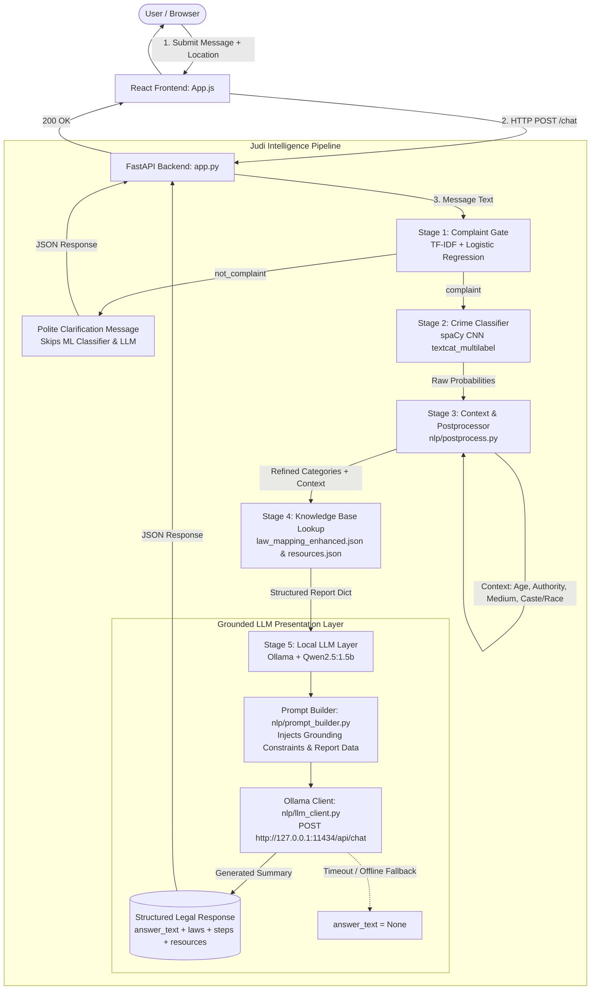

# ⚖️ Judi — AI-Powered Legal Support & Advisory System

> **A hybrid NLP & Local LLM legal assistance platform built to help students, youth, and victims in India understand their rights, navigate criminal & civil statutory provisions, follow step-by-step legal procedures, and access verified emergency support.**

---

## 📑 Table of Contents

1. [Overview & Problem Statement](#-overview--problem-statement)
2. [Key Capabilities](#-key-capabilities)
3. [System Architecture & Data Flow](#-system-architecture--data-flow)
4. [Deep Dive: How the Pipeline Works](#-deep-dive-how-the-pipeline-works)
   - [Stage 1: Binary Complaint Gate (Logistic Regression + TF-IDF)](#stage-1-binary-complaint-gate)
   - [Stage 2: Multi-Label Crime Categorizer (spaCy CNN)](#stage-2-multi-label-crime-categorizer)
   - [Stage 3: Rule-Based Postprocessor & Context Engine](#stage-3-rule-based-postprocessor--context-engine)
   - [Stage 4: Statutory Knowledge Base Aggregator](#stage-4-statutory-knowledge-base-aggregator)
   - [Stage 5: Local LLM Presentation Layer (Ollama + Qwen)](#stage-5-local-llm-presentation-layer-ollama--qwen)
5. [Supported Crime & Violation Categories](#-supported-crime--violation-categories)
6. [Project File Structure & Component Map](#-project-file-structure--component-map)
7. [Prerequisites & System Requirements](#-prerequisites--system-requirements)
8. [Installation & Setup Guide](#-installation--setup-guide)
9. [Running the System](#-running-the-system)
10. [Configuration & Environment Variables](#-configuration--environment-variables)
11. [Developer Guide: How to Extend & Retrain](#-developer-guide-how-to-extend--retrain)
    - [Adding a New Crime Category](#1-adding-a-new-crime-category)
    - [Adding Localized State / District Emergency Contacts](#2-adding-localized-contacts)
    - [Retraining the ML Models](#3-retraining-the-ml-models)
    - [Configuring or Swapping the LLM](#4-configuring-or-swapping-the-llm)
12. [API Reference & JSON Payloads](#-api-reference--json-payloads)
13. [Automated Test Suite](#-automated-test-suite)
14. [Troubleshooting & FAQ](#-troubleshooting--faq)
15. [Legal Disclaimer & License](#-legal-disclaimer--license)

---

## 🌟 Overview & Problem Statement

Navigating the Indian legal system is daunting for victims of crimes, especially students and young adults facing issues like **ragging, sexual harassment, cyberstalking, blackmail, caste discrimination, and physical violence**. Victims frequently do not know:
- Which specific laws protect them (e.g., IPC, POCSO Act, IT Act, UGC Anti-Ragging Regulations).
- What procedural steps to take immediately (FIR registration, 24-hour medical examination, cyber evidence preservation).
- Where to seek free legal aid (NALSA/SLSA) and localized emergency assistance.

**Judi** solves this by offering an accessible, preliminary legal advisory pipeline. It combines deterministic legal knowledge matching with an empathetic local AI summarization layer to give users accurate, actionable, and safe legal guidance without the risk of AI hallucination.

---

## ✨ Key Capabilities

| Capability | Description |
| :--- | :--- |
| **Two-Stage Machine Learning Gate** | Filters casual conversation from genuine complaints with **99.7% gate accuracy**, preventing false legal diagnoses on non-legal queries. |
| **Strictly Grounded Local LLM Layer** | Uses **Ollama + Qwen2.5** exclusively for summarization and empathetic presentation—**never** classifies crimes independently or hallucinates statutes. |
| **Zero-Downtime Fallback** | If Ollama is offline or times out, the backend seamlessly falls back to pre-formatted statutory reports without failing user requests. |
| **Automated POCSO & Minor Protection** | Automatically identifies victims under age 18 and applies the *Protection of Children from Sexual Offences (POCSO) Act, 2012* with mandatory anonymity notices. |
| **50+ Indian Statutory Provisions** | Maps incidents directly to applicable sections of the **Indian Penal Code (IPC)**, **Information Technology (IT) Act**, **UGC Regulations**, **POSH Act**, and the **Constitution of India**. |
| **Actionable Filing Procedures** | Delivers 8–22 practical, step-by-step procedural action items (FIR registration, evidence preservation, medical examination, institutional grievance). |
| **Location-Aware Helpline Directory** | Filters police cells, legal aid boards, and helplines dynamically by state/district (e.g., National, Kerala, Mumbai, Delhi, Bangalore). |
| **Multi-Session Chat & Secure Auth** | Supports saved consultation threads with salted SHA-256 password authentication and local storage persistence. |
| **Modern React Interface** | Dark/Light mode, expandable statutory law cards, document attachment previews, and mobile-friendly drawer sidebar. |

---

## 🧠 System Architecture & Data Flow



---

## 🔬 Deep Dive: How the Pipeline Works

### Stage 1: Binary Complaint Gate
- **Files**: [`nlp/complaint_detector.py`](file:///d:/final/legal-support-chatbot/nlp/complaint_detector.py), [`nlp/train_complaint_detector.py`](file:///d:/final/legal-support-chatbot/nlp/train_complaint_detector.py)
- **Model**: Scikit-Learn `LogisticRegression` fitted on word-level `TfidfVectorizer` features.
- **Dataset**: `data/complaint_dataset.csv` (3,189 verified samples).
- **Purpose**: Distinguishes between casual conversation (*"hello"*, *"good morning"*, *"tell me a joke"*, *"can you help me with homework"*) and genuine legal complaints (*"my senior punched me"*, *"someone leaked my photo"*).
- **Behavior**: If `is_complaint == False`, the pipeline **immediately halts** and returns a friendly prompt asking the user to describe their legal issue. It bypasses spaCy, knowledge base lookups, and the LLM, reducing latency and saving GPU/CPU compute.

### Stage 2: Multi-Label Crime Categorizer
- **Files**: [`nlp/train_classifier.py`](file:///d:/final/legal-support-chatbot/nlp/train_classifier.py), `models/legal_textcat/`
- **Model**: Blank English spaCy CNN pipeline with a `textcat_multilabel` component.
- **Dataset**: `data/dataset.csv` (1,750 multi-class crime samples across 20 categories).
- **Purpose**: Generates independent sigmoid probability scores for each of the 20 supported crime categories simultaneously (allowing multi-offense detection like physical assault + ragging).

### Stage 3: Rule-Based Postprocessor & Context Engine
- **File**: [`nlp/postprocess.py`](file:///d:/final/legal-support-chatbot/nlp/postprocess.py)
- **Purpose**: Refines raw classifier probabilities using deterministic heuristics and extracts contextual variables:
  1. **Age Indicator (`extract_age_indicator`)**: Detects explicit ages (*"I am 16"*, *"age: 17"*) or school keywords (*"10th standard"*, *"minor"*). Automatically triggers the **POCSO Act** framework for minors in sexual offenses.
  2. **Authority Disambiguation (`extract_authority`)**: Identifies relationships (*"professor"*, *"teacher"*, *"principal"*, *"hostel warden"*, *"senior student"*) to distinguish ragging/institutional misconduct from interpersonal offenses.
  3. **Medium Disambiguation (`extract_medium`)**: Identifies whether the incident occurred online (WhatsApp, Instagram, DMs, cyberbullying) or offline (hostel, classroom, street) and filters out cyber categories for physical incidents.
  4. **Protected Characteristics (`extract_discrimination_type`)**: Detects caste, religion, racial/northeast origin, or gender keywords to map offenses under the *SC/ST (Prevention of Atrocities) Act* or constitutional provisions.

### Stage 4: Statutory Knowledge Base Aggregator
- **Files**: [`data/law_mapping_enhanced.json`](file:///d:/final/legal-support-chatbot/data/law_mapping_enhanced.json), [`data/resources.json`](file:///d:/final/legal-support-chatbot/data/resources.json), [`data/local_numbers.json`](file:///d:/final/legal-support-chatbot/data/local_numbers.json)
- **Purpose**: Takes the matched categories and context from Stage 3 and aggregates:
  - Governing statutory acts and sections (Act name, Section number, Title, Detailed description).
  - Concrete step-by-step procedural filing guidelines.
  - National and location-specific emergency contacts (police stations, legal aid boards, helplines).

### Stage 5: Local LLM Presentation Layer (Ollama + Qwen)
- **Files**: [`nlp/prompt_builder.py`](file:///d:/final/legal-support-chatbot/nlp/prompt_builder.py), [`nlp/llm_client.py`](file:///d:/final/legal-support-chatbot/nlp/llm_client.py)
- **Model**: `qwen2.5:1.5b` (or any local Qwen model running in Ollama).
- **Core Principle**: **The LLM is strictly a presentation and summarization layer.**
  - The LLM **does not** classify the crime.
  - The LLM **cannot** invent or alter law sections, procedural steps, or phone numbers.
  - It receives the structured report as ground truth and outputs an empathetic, coherent explanation organized into clean sections:
    - 📋 **Case Summary & Legal Context**
    - ⚖️ **Applicable Legal Provisions**
    - 📝 **Recommended Action Steps**
    - 📞 **Support & Emergency Contacts**
    - ⚠️ **Important Advisory / Safety Notes**
- **Fallback Mechanism**: If Ollama is offline or times out (configurable via `OLLAMA_TIMEOUT`), `generate_legal_summary` returns `None`. The backend returns the structured fields, and the frontend automatically renders the pre-formatted report.

---

## 🎯 Supported Crime & Violation Categories

### 1. Violence & Physical Crimes
- **Physical Assault** (*IPC 323, 324, 325, 336, 341, 342*)
- **Sexual Assault** (*IPC 375, 376, 376A, POCSO Act Sec. 3, 5*)
- **Sexual Harassment** (*IPC 354A, 354D, POSH Act 2013*)
- **Ragging** (*UGC Anti-Ragging Regulations 2009, Anti-Ragging Act*)

### 2. Online & Cyber Crimes
- **Cyber Harassment** (*IT Act 66E, 67, IPC 354D, 509*)
- **Cyber Sexual Crime** (*IT Act 67A, 67B, POCSO Act Sec. 14, 15*)
- **Impersonation & Doxxing** (*IT Act 66C, 66D, IPC 419*)
- **Online Hate Speech** (*IPC 153A, 295A, 505(2)*)

### 3. Discrimination & Civil Rights Violations
- **Caste Discrimination** (*SC/ST Prevention of Atrocities Act 1989, Constitution Art. 17*)
- **Religious Discrimination** (*Constitution Art. 15, 25, IPC 295, 298*)
- **Racism & Regional Bias** (*IPC 153A, Constitution Art. 15*)
- **Gender Discrimination** (*Constitution Art. 14, 15, 16, UGC Guidelines*)
- **General Discrimination** (*Equal Opportunities Act, Rights of Persons with Disabilities*)
- **Threats & Criminal Intimidation** (*IPC 503, 506*)
- **Stalking** (*IPC 354D, IT Act 2000*)

### 4. Exploitation & Institutional Misconduct
- **Blackmail & Extortion** (*IPC 383, 384, 385, 506*)
- **Defamation & Privacy Violations** (*IPC 499, 500, IT Act 66E*)
- **Verbal Abuse & Insult** (*IPC 504*)
- **Institutional Misconduct** (*UGC Grievance Redressal Regulations*)
- **Administrative Violations** (*Unlawful withholding of degrees/TC, illegal bond enforcement*)

---

## 📁 Project File Structure & Component Map

```
legal-support-chatbot/
├── README.md                          # Comprehensive project documentation
├── app.py                             # FastAPI backend API router & pipeline coordinator
├── requirements.txt                   # Python backend dependencies
├── setup.sh                           # One-time environment setup script (Linux / macOS)
├── start.ps1                          # PowerShell startup script (Windows)
├── start.bat                          # Batch startup script (Windows)
├── start.sh                           # Shell startup script (Linux / macOS)
│
├── frontend/                          # React Single-Page Application (SPA)
│   ├── package.json                   # Node.js dependencies & scripts
│   ├── package-lock.json              # Locked dependency tree
│   ├── public/
│   │   └── index.html                 # Main HTML DOM container
│   └── src/
│       ├── App.js                     # Core React component: chat, auth, location, expanded details
│       ├── App.css                    # Custom responsive CSS design system (Light & Dark themes)
│       └── index.js                   # React DOM entry point
│
├── nlp/                              # NLP & Machine Learning Subsystem
│   ├── complaint_detector.py         # Stage 1: Logistic Regression inference helper
│   ├── train_complaint_detector.py   # Stage 1: TF-IDF + Logistic Regression training script
│   ├── train_classifier.py           # Stage 2: spaCy CNN multi-label training script
│   ├── postprocess.py                # Stage 3: Context extraction, POCSO heuristics, rule engine
│   ├── prompt_builder.py             # Stage 5: Grounded prompt builder for Local LLM
│   └── llm_client.py                 # Stage 5: Ollama API client with fallback handling
│
├── models/                           # Serialized Machine Learning Model Weights
│   ├── complaint_detector/           # Stage 1 Artifacts
│   │   ├── logreg_model.joblib       # Fitted Logistic Regression classifier
│   │   └── tfidf_vectorizer.joblib   # Fitted TF-IDF feature vocabulary
│   └── legal_textcat/               # Stage 2 Artifacts (spaCy multi-label model)
│       ├── meta.json
│       ├── textcat/
│       ├── tokenizer
│       └── vocab/
│
├── data/                             # Knowledge Base, Mappings & User Datastores
│   ├── complaint_dataset.csv         # 3,189 binary labeled samples for Stage 1 gate
│   ├── dataset.csv                   # 1,750 multi-class crime samples for Stage 2
│   ├── law_mapping_enhanced.json     # 50+ statutory provisions and filing procedures
│   ├── resources.json                # National emergency helplines, police cells, legal aid
│   ├── local_numbers.json            # State/district localized contact directories
│   ├── case_laws.json                # Landmark case law citations
│   ├── users.json                    # User account database (salted SHA-256 passwords)
│   └── consultations/                # User session chat histories (<username>.json)
│
├── scripts/                          # Synthetic Data Generation Utilities
│   ├── create_complaint_dataset.py   # Generates Stage 1 binary training dataset
│   └── generate_dataset.py           # Generates Stage 2 20-category multi-class dataset
│
├── scratch/                          # Developer scratch scripts (not for production)
│
└── tests/                            # Automated Testing Suite
    ├── test_complaint_detector.py    # Unit tests for Stage 1 gate (20 test cases)
    ├── test_postprocess.py           # Unit tests for context extraction (7 test cases)
    ├── test_query.py                 # Multi-class integration tests for Stage 2 (30 test cases)
    ├── test_llm_integration.py       # Prompt builder, offline fallback & live Qwen tests
    └── test_api.py                   # FastAPI TestClient endpoint & contract tests
```

---

## 💻 Prerequisites & System Requirements

1. **Python**: Python 3.10 or 3.11 installed.
2. **Node.js**: Node.js 18+ and npm installed.
3. **Ollama (Recommended for Local LLM responses)**:
   - Download and install [Ollama](https://ollama.com).
   - Pull the default lightweight model:
     ```bash
     ollama pull qwen2.5:1.5b
     ```
   *(Note: The system remains 100% functional even if Ollama is not installed, falling back to structured legal reports).*

---

## 📦 Installation & Setup Guide

### Step 1: Clone the Repository
```bash
git clone https://github.com/<your-username>/legal-support-chatbot.git
cd legal-support-chatbot
```

### Step 2: Set Up Python Virtual Environment
```bash
# Create virtual environment
python -m venv venv

# Activate on Windows (PowerShell):
.\venv\Scripts\Activate.ps1

# Activate on Linux / macOS:
source venv/bin/activate
```

### Step 3: Install Backend Dependencies
```bash
pip install -r requirements.txt
```

### Step 3b: Download the spaCy Language Model

The Stage 2 crime classifier uses `en_core_web_md` as a **vector source** for its `tok2vec` component. This is a spaCy model and must be downloaded separately:

```bash
python -m spacy download en_core_web_md
```

> **Note**: This is a one-time download (~50 MB). Without it, `nlp/train_classifier.py` will fail with a `OSError: [E050] Can't find model 'en_core_web_md'` error.

### Step 4: Install Frontend Dependencies
```bash
cd frontend
npm install
cd ..
```

---

## 🚀 Running the System

### Method 1: One-Click Startup Scripts

- **Windows (PowerShell)**:
  ```powershell
  .\start.ps1
  ```
- **Windows (Command Prompt)**:
  ```cmd
  start.bat
  ```
- **Linux / macOS**:
  ```bash
  chmod +x start.sh
  ./start.sh
  ```

### Method 2: Manual Terminal Startup

**Terminal 1 — Local LLM Server**:
```bash
ollama run qwen2.5:1.5b
```

**Terminal 2 — Backend API Server**:
```bash
python -m uvicorn app:app --reload --port 8000
```

**Terminal 3 — Frontend React Dev Server**:
```bash
cd frontend
PORT=3001 npm start
```

Open your browser and navigate to:
```
http://localhost:3001
```

---

## ⚙️ Configuration & Environment Variables

You can customize the application behavior via environment variables:

| Variable | Default | Description |
| :--- | :--- | :--- |
| `OLLAMA_BASE_URL` | `http://127.0.0.1:11434` | Base URL of the Ollama server |
| `OLLAMA_MODEL` | `qwen2.5:1.5b` | Model name to use in Ollama (e.g. `qwen2.5:3b`, `qwen2.5:7b`) |
| `OLLAMA_TIMEOUT` | `30` | Request timeout for LLM generation (in seconds) |

---

## 🛠️ Developer Guide: How to Extend & Retrain

### 1. Adding a New Crime Category
To add a new category (e.g., `workplace_fraud`):

1. **Add training data**: Open [`scripts/generate_dataset.py`](file:///d:/final/legal-support-chatbot/scripts/generate_dataset.py) and add templates for the new category. Run `python scripts/generate_dataset.py` to regenerate `data/dataset.csv`.
2. **Retrain Stage 2 classifier**:
   ```bash
   python nlp/train_classifier.py
   ```
3. **Add statutory mappings & filing steps**: Open [`data/law_mapping_enhanced.json`](file:///d:/final/legal-support-chatbot/data/law_mapping_enhanced.json) and add the category key with applicable laws (Act, Section, Title, Description) and filing procedures.
4. **Add helplines & resources**: Open [`data/resources.json`](file:///d:/final/legal-support-chatbot/data/resources.json) and add police stations, helplines, and legal aid contacts for the category.
5. **Update postprocessor rules (Optional)**: If specific keywords or age rules apply, update [`nlp/postprocess.py`](file:///d:/final/legal-support-chatbot/nlp/postprocess.py).

### 2. Adding Localized Contacts
To add emergency contacts for a new state or district (e.g., `"Tamil Nadu"`):
1. Open [`data/local_numbers.json`](file:///d:/final/legal-support-chatbot/data/local_numbers.json).
2. Add a new key for the region with its police stations, helplines, and legal aid contacts:
   ```json
   "tamil_nadu": {
     "police_stations": [
       { "name": "Tamil Nadu State Police", "location": "Chennai", "contact": "112", "link": "https://eservices.tnpolice.gov.in" }
     ],
     "helplines": [
       { "name": "Women Helpline TN", "contact": "181" }
     ],
     "legal_aid": [
       { "name": "TNSLSA Legal Aid", "contact": "044-25342834" }
     ]
   }
   ```
3. The frontend location selector will automatically populate the new location choices via the `/locations` API endpoint.

### 3. Retraining the ML Models

#### Retrain Stage 1 (Complaint Gate)
```bash
python scripts/create_complaint_dataset.py
python nlp/train_complaint_detector.py
```
*Trained model artifacts are saved in `models/complaint_detector/`.*

#### Retrain Stage 2 (Multi-Class Crime Classifier)
```bash
python scripts/generate_dataset.py
python nlp/train_classifier.py
```
*Trained spaCy CNN weights are saved in `models/legal_textcat/`.*

### 4. Configuring or Swapping the LLM
You can switch to any local model supported by Ollama without writing code:
```powershell
# In PowerShell:
$env:OLLAMA_MODEL = "qwen2.5:7b"
python -m uvicorn app:app --port 8000
```
Or define it in an environment `.env` file.

---

## 📡 API Reference & JSON Payloads

### 1. `POST /chat` — Core Advisory Endpoint

#### Request Body
```json
{
  "message": "My senior beaten me up in the hostel. I am 19 years old.",
  "location": "kerala"
}
```

#### Complaint Response (`200 OK`)
```json
{
  "category": "physical_assault",
  "confidence": 0.35,
  "reason": "classified",
  "is_complaint": true,
  "status": "complaint",
  "answer_text": "### 📋 Case Summary & Legal Context\nThe incident involves a physical assault by a senior student in a hostel environment...\n\n### ⚖️ Applicable Legal Provisions\n- **Section 323 (Indian Penal Code)**: Voluntarily causing hurt...\n\n### 📝 Recommended Action Steps\n1. File a First Information Report (FIR) at the nearest police station...\n2. Undergo medical examination within 24 hours...\n\n### 📞 Support & Emergency Contacts\n- Local Police Station | Contact: 112\n\n### ⚠️ Important Advisory\nConsult a licensed legal practitioner for formal proceedings.",
  "matched_categories": [
    { "category": "physical_assault", "confidence": 0.35 },
    { "category": "ragging", "confidence": 0.22 }
  ],
  "context": {
    "age_indicator": "adult",
    "authority": "senior_student",
    "medium": "offline",
    "discrimination_types": [],
    "legal_framework": null,
    "location": "kerala"
  },
  "legal_frameworks": [
    "Indian Penal Code (IPC)",
    "Anti-Ragging Act & National Anti-Ragging Rules"
  ],
  "laws": [
    {
      "act": "Indian Penal Code",
      "section": "323",
      "title": "Voluntarily causing hurt",
      "description": "Whoever, except in the case provided by law, voluntarily causes hurt shall be punished with imprisonment up to one year, or fine up to one thousand rupees, or both."
    }
  ],
  "steps": [
    "File First Information Report (FIR) at nearest police station",
    "Get medical examination done immediately (within 24 hours ideally)",
    "Collect medical certificates and photographs of injuries",
    "Report to the Anti-Ragging Committee of your institution"
  ],
  "resources": [
    {
      "name": "Local Police Station",
      "location": "Nearest police station in your jurisdiction",
      "contact": "112",
      "link": "https://www.keralapolice.gov.in"
    }
  ],
  "case_references": [],
  "warnings": []
}
```

#### Non-Complaint Response (`200 OK`)
```json
{
  "category": "not_complaint",
  "confidence": 0.95,
  "reason": "not_complaint",
  "is_complaint": false,
  "status": "not_complaint",
  "message": "Please describe the legal issue or incident you want help with.",
  "answer_text": "Please describe the legal issue or incident you want help with.",
  "matched_categories": [],
  "context": { "location": "national" },
  "legal_frameworks": [],
  "laws": [],
  "steps": [],
  "resources": [],
  "case_references": [],
  "warnings": []
}
```

---

### 2. Authentication & Consultation Endpoints

| Endpoint | Method | Description | Payload / Params |
| :--- | :--- | :--- | :--- |
| `POST /signup` | `POST` | Create a user account | `{"username": "user1", "password": "password123"}` |
| `POST /login` | `POST` | Authenticate user credentials | `{"username": "user1", "password": "password123"}` |
| `GET /locations` | `GET` | Get list of supported regions | Returns `{"locations": ["national", "kerala", "mumbai", ...]}` |
| `GET /consultations/{username}` | `GET` | Retrieve user chat threads | `username` in path |
| `POST /consultations/{username}` | `POST` | Save user chat threads | JSON with consultations list |

---

## 🧪 Automated Test Suite

Run the full test suite from the repository root:

```bash
# 1. Test Stage 1 Complaint Gate (20 test cases)
python tests/test_complaint_detector.py

# 2. Test Postprocessor Context Engine (Age, Authority, Medium, Caste/Race)
python tests/test_postprocess.py

# 3. Test Multi-Class Crime Classifier & Rules (30 integration cases)
python tests/test_query.py

# 4. Test Prompt Builder, Offline Fallback & Live Qwen Generation
python tests/test_llm_integration.py

# 5. Test FastAPI Endpoints (Contract tests, Gate, Auth, History)
python tests/test_api.py
```

---

## ❓ Troubleshooting & FAQ

### Q1: What happens if Ollama is not installed or offline?
**A**: The system continues to work smoothly. The backend catches connection errors and sets `answer_text: None`. The React frontend automatically falls back to rendering the comprehensive structured preliminary report with expandable cards.

### Q2: Why is the LLM not allowed to classify crimes directly?
**A**: General-purpose LLMs are prone to legal hallucinations and overconfidence. In Judi, classifications and statutory mappings are strictly governed by validated machine learning models and vetted JSON knowledge bases. The LLM only handles natural-language summarization of verified facts.

### Q3: How do I resolve `Port 8000 / 3001 already in use`?
- **Windows**:
  ```powershell
  netstat -ano | findstr :8000
  taskkill /PID <PID> /F
  ```
- **Linux / macOS**:
  ```bash
  fuser -k 8000/tcp
  ```

---

## ⚠️ Legal Disclaimer

> **IMPORTANT**: Judi is an automated educational and preliminary legal assistance tool. It does **not** constitute formal legal representation or binding legal advice. Users facing active threats or emergency situations should immediately contact emergency authorities (dial **112**) or consult a licensed advocate / legal aid authority.

---

## 📄 License

This project is open-source software licensed under the **MIT License**.
